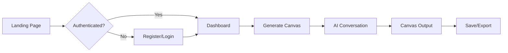

# InnoCanvas - Product Requirements Document (PRD)

## 📋 Product Overview

**InnoCanvas** is an AI-powered web application that helps entrepreneurs, students, and business professionals create comprehensive Business Model Canvases (BMC) using artificial intelligence.

🌐 **Live Site**: [innocanvas.site](https://innocanvas.site)

---

## 🎯 Problem Statement

Creating a Business Model Canvas manually is time-consuming and requires significant business expertise. Many entrepreneurs struggle to articulate their business model components clearly, leading to incomplete or poorly structured canvases.

---

## 💡 Solution

InnoCanvas leverages **OpenAI GPT-4o-mini** to guide users through an intelligent, multi-step BMC generation process. Users describe their business idea, answer refinement questions, and receive a professional, editable canvas.

---

## 👥 Target Users

| Segment | Use Case |
|---------|----------|
| **Entrepreneurs** | Validate and articulate startup ideas |
| **Students** | Academic projects and coursework |
| **Business Professionals** | Strategic planning and pivots |
| **Consultants** | Client workshops and presentations |

---

## ✨ Core Features

### 1. AI-Powered BMC Generation
- Multi-step guided conversation with GPT-4o-mini
- Context-aware refinement questions
- Professional business-ready output

### 2. User Authentication
- Supabase Auth with Google OAuth
- Email verification
- Role-based access (user/admin)

### 3. Subscription Tiers
| Plan | Features |
|------|----------|
| **Free** | Limited generations, basic export |
| **Pro** | More generations, priority support |
| **Premium** | Unlimited generations, all features |

### 4. Canvas Management
- Save, load, and organize canvases
- Public/private sharing
- Tagging system
- PDF export with custom branding

### 5. Visual Customization
- Logo upload
- Color customization (primary, card, background)
- Professional branding options

### 6. Admin Dashboard
- User management
- Subscription monitoring
- Revenue tracking
- Canvas moderation
- Activity audit logs

---

## 🛠️ Tech Stack

| Layer | Technology |
|-------|------------|
| Framework | Next.js 15 (App Router) |
| Language | TypeScript |
| Styling | Tailwind CSS + shadcn/ui |
| Auth/Database | Supabase (PostgreSQL) |
| AI | OpenAI GPT-4o-mini |
| Payments | LemonSqueezy |
| Hosting | Vercel |

---

## 📐 Key User Flows



---

## 📈 Success Metrics

- **User Acquisition**: Monthly signups
- **Engagement**: Canvases generated per user
- **Conversion**: Free → Pro/Premium upgrade rate
- **Retention**: Monthly active users (MAU)

---

## 🚀 Current Status

### ✅ Completed
- Full BMC generation with AI
- Authentication system
- Payment integration (LemonSqueezy)
- Admin dashboard
- Responsive UI/UX
- Database schema

### 🔄 Pending
- LemonSqueezy account activation
- Google Analytics 4 integration
- Production env configuration

---

## 📁 Project Structure

```
src/
├── app/           # Next.js routes (admin, generate, payment, etc.)
├── components/    # UI components (landing, plan, ui)
├── hooks/         # Custom React hooks
├── lib/           # Utility libraries
└── ai/            # AI service integration
```

---

## 📚 Related Documentation

- [Full Project Documentation](../PROJECT_DOCUMENTATION.md)
- [Admin Setup Guide](../ADMIN_SETUP_GUIDE.md)
- [LemonSqueezy Setup](../LEMON_SQUEEZY_SETUP.md)
- [Launch Checklist](../LAUNCH_CHECKLIST.md)
